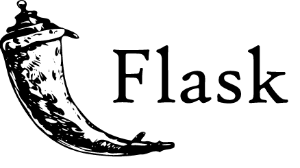

# 🎬 Movie Recommendation System

<div align="center">

  
  <h3>A Full-Stack Machine Learning Application</h3>
  <p>Production-ready movie recommendation system with user authentication, multiple ML models, and cloud deployment</p>
  <p><strong>Live Demo:</strong> Search through 1,682 movies • Get personalized recommendations • Track your viewing history</p>
  
  <p>
    <a href="#-features">Features</a> •
    <a href="#-tech-stack">Tech Stack</a> •
    <a href="#-architecture">Architecture</a> •
    <a href="#-quick-start">Quick Start</a> •
    <a href="#-deployment">Deployment</a> •
    <a href="#-api-documentation">API Docs</a>
  </p>
</div>

---

## 📸 Application Screenshot

  

  


The application features a modern, intuitive interface with:

- **Header Navigation**: Model selection dropdown (EASE, ItemKNN, NeuralMF, DeepFM), recommendation button, and user profile controls
- **Search & Filter**: Real-time movie search with genre filtering
- **Movie Grid**: Beautiful poster-based display of 1,682 available movies
- **Interactive Cards**: Click-to-add functionality for building recommendation context
- **Responsive Design**: Clean, professional UI built with Semantic UI React

---

## ✨ Features

### 🔐 User Authentication & Management
- **JWT-based authentication** with secure token management
- User registration and login with password hashing (Flask-Bcrypt)
- Protected API routes with role-based access
- User profile management

### 🤖 Machine Learning Models
- **4 Recommendation Algorithms**:
  - **EASE** (Embarrassingly Shallow Autoencoders) - Fast, efficient collaborative filtering
  - **ItemKNN** - Item-based collaborative filtering
  - **NeuralMF** - Neural Matrix Factorization with PyTorch
  - **DeepFM** - Deep Factorization Machine for complex feature interactions
- Offline model training with checkpoint saving
- Real-time recommendation generation
- Model evaluation metrics (Precision@K, Recall@K, NDCG@K)

### 📊 User Interaction Tracking
- Track user movie views, ratings, and interactions
- Batch interaction logging for performance
- Personalized recommendations based on user history

### 🎨 Modern UI/UX
- Responsive React frontend with Semantic UI
- Real-time search and filtering
- Interactive movie selection and recommendation display
- Clean, intuitive user interface

### ☁️ Production Deployment
- **Backend**: Deployed on Render with MongoDB Atlas
- **Frontend**: Deployed on Vercel
- **ML API**: Separate microservice on Render
- Environment-based configuration
- CORS handling for cross-origin requests

---

## 🛠 Tech Stack

### Frontend
<div align="center">
  
  
</div>

- **React 17** - Modern UI framework
- **Semantic UI React** - Component library
- **React Scripts** - Build tooling
- **Concurrently** - Parallel script execution

### Backend
<div align="center">
  
</div>

- **Flask 2.3.3** - Python web framework
- **Flask-SQLAlchemy** - ORM for database operations
- **Flask-Bcrypt** - Password hashing
- **Flask-CORS** - Cross-origin resource sharing
- **Flask-Migrate** - Database migrations
- **PyJWT** - JSON Web Token authentication
- **Gunicorn** - Production WSGI server

### Machine Learning
<div align="center">
  
  
</div>

- **PyTorch** - Deep learning framework for NeuralMF and DeepFM
- **NumPy** - Numerical computing
- **Scikit-learn** - Machine learning utilities
- **SciPy** - Scientific computing
- **Pandas** - Data manipulation

### Database & Storage
- **MongoDB Atlas** - Cloud NoSQL database (production)
- **SQLite** - Local development database
- **SQLAlchemy** - Database ORM

### DevOps & Deployment
- **Render** - Backend and ML API hosting
- **Vercel** - Frontend hosting
- **MongoDB Atlas** - Managed database service
- **GitHub Actions** - CI/CD (if configured)

---

## 🏗 Architecture

```
┌─────────────────┐
│   React Frontend│  (Vercel)
│   Port: 3000    │
└────────┬────────┘
         │ HTTP/REST
         ▼
┌─────────────────┐
│  Flask Backend  │  (Render)
│   Port: 5555    │
└────────┬────────┘
         │
    ┌────┴────┐
    │         │
    ▼         ▼
┌─────────┐ ┌──────────────┐
│ MongoDB │ │  ML API      │  (Render)
│  Atlas  │ │  Port: 8000  │
└─────────┘ └──────────────┘
```

### Component Responsibilities

- **Frontend (React)**: User interface, API calls, state management
- **Backend (Flask)**: Business logic, authentication, database operations, API orchestration
- **ML API (Flask)**: Model loading, recommendation generation, model inference
- **Database (MongoDB/SQLite)**: User data, movie data, interaction history

---

## 🚀 Quick Start

### Prerequisites
- Python 3.9+
- Node.js 18+ (use `.nvmrc` for version management)
- MongoDB Atlas account (for production) or SQLite (for local)

### Installation

1. **Clone the repository**
```bash
git clone https://github.com/DavidOmokagbor1/MOvie-Recommendation.git
cd MOvie-Recommendation
```

2. **Backend Setup**
```bash
cd fullstack_recsys/backend
pip install -r requirements.txt
```

3. **Frontend Setup**
```bash
cd react-front
npm install --legacy-peer-deps
```

4. **Initialize Database** (Optional - pre-built DB included)
```bash
cd backend
flask db init
flask db migrate
flask db upgrade
python initialize_ml100k_db.py
```

5. **Train ML Models** (Optional - pre-trained models included)
```bash
cd api
python fit_offline.py --model EASE --save_dir recommend/ckpt
python fit_offline.py --model ItemKNN --save_dir recommend/ckpt
```

### Running Locally

**Option 1: Run all services together**
```bash
cd react-front
npm run start-all
```

**Option 2: Run services separately**

Terminal 1 - ML API:
```bash
cd api
python api.py
```

Terminal 2 - Backend:
```bash
cd fullstack_recsys/backend
python run.py
```

Terminal 3 - Frontend:
```bash
cd react-front
npm start
```

### Access the Application
- **Frontend**: http://localhost:3000
- **Backend API**: http://localhost:5555
- **ML API**: http://localhost:8000

---

## ☁️ Deployment

### Production URLs
- **Frontend**: [Vercel Deployment](https://your-app.vercel.app)
- **Backend**: [Render Deployment](https://your-backend.onrender.com)
- **ML API**: [Render Deployment](https://your-ml-api.onrender.com)

### Deployment Configuration

**Backend (Render)**
- Root Directory: `fullstack_recsys/backend`
- Build Command: `pip install --upgrade pip setuptools wheel && pip install -r requirements.txt`
- Start Command: `gunicorn run:app --bind 0.0.0.0:$PORT --workers 2 --timeout 120`
- Environment Variables:
  - `MONGODB_URI` - MongoDB Atlas connection string
  - `FLASK_ENV=production`
  - `ML_API_URL` - ML API service URL

**Frontend (Vercel)**
- Root Directory: `react-front`
- Build Command: `npm run build`
- Environment Variables:
  - `REACT_APP_API_URL` - Backend API URL
  - `REACT_APP_ML_API_URL` - ML API URL

**ML API (Render)**
- Root Directory: `fullstack_recsys/api`
- Build Command: `pip install -r requirements.txt`
- Start Command: `gunicorn api:app --bind 0.0.0.0:$PORT`

See [RENDER_DEPLOYMENT_GUIDE.md](RENDER_DEPLOYMENT_GUIDE.md) for detailed deployment instructions.

---

## 📚 API Documentation

### Authentication Endpoints

**Register User**
```http
POST /api/auth/register
Content-Type: application/json

{
  "username": "john_doe",
  "email": "john@example.com",
  "password": "secure_password",
  "age": 25,
  "gender": "M"
}
```

**Login**
```http
POST /api/auth/login
Content-Type: application/json

{
  "username": "john_doe",
  "password": "secure_password"
}
```

**Get Current User** (Protected)
```http
GET /api/auth/user
Authorization: Bearer <jwt_token>
```

### Movie Endpoints

**Get Movies** (Paginated)
```http
GET /api/movies?page=1&per_page=20
```

**Search Movies**
```http
GET /api/movies/search?q=action&key=title
```

**Get Movie Details**
```http
GET /api/movies/{movie_id}/details
```

### Recommendation Endpoints

**Get Recommendations**
```http
POST /recommend
Content-Type: application/json

{
  "model": "EASE",
  "context": [1, 2, 3]
}
```

### Interaction Endpoints

**Log Interaction**
```http
POST /api/interactions
Authorization: Bearer <jwt_token>
Content-Type: application/json

{
  "movie_id": 123,
  "interaction_type": "view",
  "rating": 5
}
```

**Batch Log Interactions**
```http
POST /api/interactions/batch
Authorization: Bearer <jwt_token>
Content-Type: application/json

{
  "interactions": [
    {"movie_id": 123, "interaction_type": "view"},
    {"movie_id": 456, "interaction_type": "like", "rating": 4}
  ]
}
```

See [API_DOCUMENTATION.md](fullstack_recsys/API_DOCUMENTATION.md) for complete API documentation.

---

## 🧪 Testing

### Backend API Testing
```bash
cd fullstack_recsys/backend
python test_endpoints.py
```

### Frontend Testing
```bash
cd react-front
npm test
```

---

## 📊 Dataset

This project uses the **MovieLens 100K** dataset:
- **943 users**
- **1,682 movies**
- **100,000 ratings**
- Pre-loaded in the database for immediate use

---

## 🔧 Key Features Implemented

✅ **Production-Ready Architecture**
- Microservices architecture (Frontend, Backend, ML API)
- Environment-based configuration
- Error handling and logging
- Graceful fallbacks (SQLite if MongoDB unavailable)

✅ **Security**
- JWT authentication
- Password hashing with Bcrypt
- CORS configuration
- Input validation

✅ **Performance**
- Database indexing
- Batch operations
- Model checkpointing
- Connection pooling

✅ **Developer Experience**
- Comprehensive documentation
- Clear code structure
- Error messages
- Deployment guides

---

## 📁 Project Structure

```
MOvie-Recommendation/
├── fullstack_recsys/
│   ├── backend/          # Flask backend application
│   │   ├── app/          # Application modules
│   │   ├── run.py        # Application entry point
│   │   └── requirements.txt
│   ├── api/              # ML API service
│   │   ├── recommend/    # Recommendation models
│   │   └── api.py        # API server
│   └── react-front/      # React frontend
│       ├── src/
│       └── package.json
├── img/                  # Project images and logos
├── docs/                  # Documentation files
└── README.md
```

---

## 🤝 Contributing

Contributions are welcome! Please feel free to submit a Pull Request.

---

## 📝 License

This project is open source and available under the MIT License.

---

## 👤 Author

**David Omokagbor**

- GitHub: [@DavidOmokagbor1](https://github.com/DavidOmokagbor1)
- Project Link: [https://github.com/DavidOmokagbor1/MOvie-Recommendation](https://github.com/DavidOmokagbor1/MOvie-Recommendation)

---

## 🙏 Acknowledgments

- MovieLens dataset providers
- Flask and React communities
- PyTorch team for excellent ML framework
- Render and Vercel for hosting services

---

<div align="center">
  <p>Made with ❤️ using React, Flask, and PyTorch</p>
  <p>
    
    
    
  </p>
</div>
